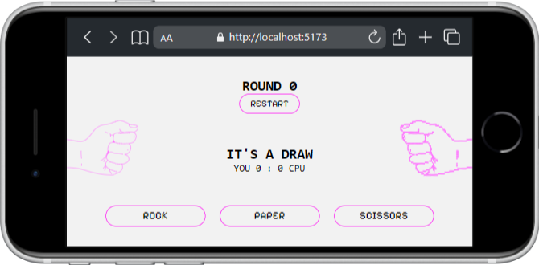

# Rock Paper Scissors Game ✂️🪨📃

  

 

This is project is a simple, infinite game of Rock Paper Scissors built with React, featuring my own illustrations.

## Table of Contents 📑

- [About](#about)
- [Features](#features)
- [Tech Stack](#tech-stack)
- [Design](#design)
- [Future Possibilities](#future-possibilities)

## About

    
    

## Features
<ul>
    <li>Buttons for game choices and restart with hover effects as user feedback</li>
    <li>Randomised CPU choices</li>
    <li>Responsive layout optimised for different screens</li>
    <li>Screen notice for user to flip device when in portrait mode</li>
</ul>

## Tech Stack

**Markup:**  
  
**Styling:**  
  
**Library:**  
  
**Programming language:**  
  
**Design:**  
  
**IDE:**  
  
**Version Control:**  
  

## Design

I used Figma for my original design process. I have also created the graphics for the hand gestures by taking photos of my own hands, drawing them on paper and finally tracing those drawings, with a lot of care, as vector images in Adobe Illustrator.

## Future Possibilities 

<ul>
    <li>Bigger feedback for win or loss</li>
    <li>setTimeout and countdown until result<li/>
    <li>Animation on notice screen</li>
<ul/>