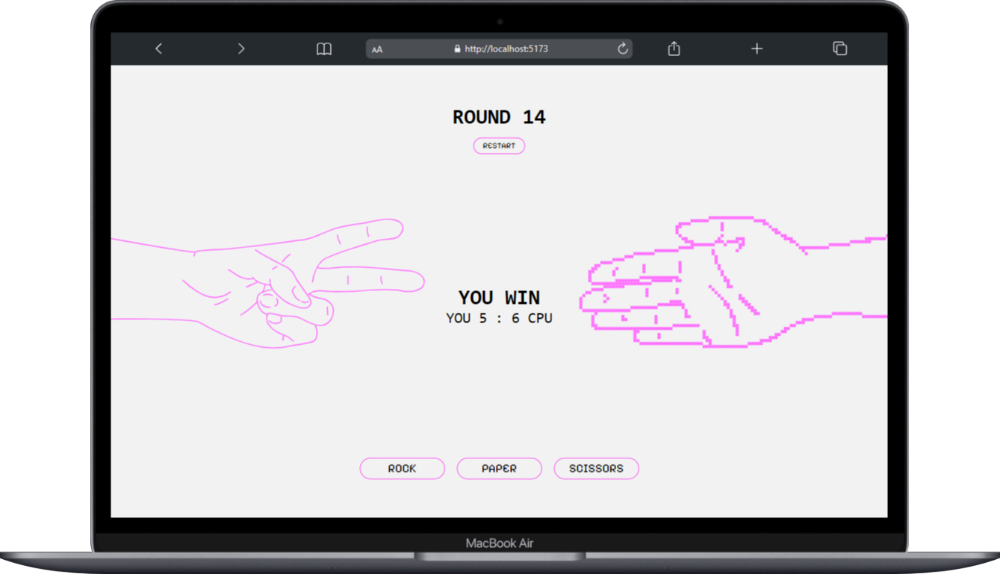
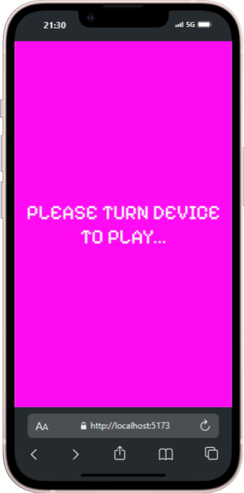

# Rock Paper Scissors Game ✂️🪨📃

<p>This is project is a simple, infinite game of Rock Paper Scissors built with React, featuring my own illustrations.</p>

<div style="display: flex; justify-content: center;">
  
</div>

## Table of Contents 📑

- [Features](#features)
- [Tech Stack](#tech-stack)
- [Installation & Setup](#installation-&-setup)
- [Design](#design)
- [Future Possibilities](#future-possibilities)

## Features
<div style="display: flex;">
    
    <ul style="width: 49%">
        <li>Buttons with hover effects as user feedback</li>
        <li>Randomised CPU choices</li>
        <li>Infinite game with score tracking for user and CPU</li>
        <li>Restart game option</li>
        <li>Responsive layout optimised for different screens</li>
        <li>Screen notice for user to flip device when in portrait mode</li>
        <li>Classic game rules
            <ul>
                <li>Rock beats Scissors</li>
                <li>Scissors beat Paper</li>
                <li>Paper beats Rock</li>
                <li>If the choices are same, it's a draw</li>
            </ul>
        </li>
    </ul>
</div>

## Tech Stack

**Markup:**  
  
**Styling:**  
  
**Library:**  
  
**Programming language:**  
  
**Design:**  
  
**IDE:**  
  
**Version Control:**  
  

## Installation & Setup

You can play the game <a href="https://bz-rock-paper-scissors.vercel.app/" title="Play game in browser">here</a> in your local browser. To run the project locally, follow these steps:

1. **Clone the repository:**
   ```bash
   git clone https://github.com/bebzbzbz/Rock-Paper-Scissors-Game.git
   ```

2. **Install dependencies & run the development server:**
   ```bash
   npm install
   npm run dev
   ```

3. **Open your local host and play! 🕹️**

## Design

I used Figma for my original design process. I have also created the graphics for the hand gestures by taking photos of my own hands, drawing them on paper and finally tracing those drawings, with a lot of care, as vector images in Adobe Illustrator.

## Future Possibilities 

<ul>
    <li>Bigger feedback for win or loss</li>
    <li>setTimeout and countdown until result</li>
    <li>Animation on notice screen</li>
<ul/>